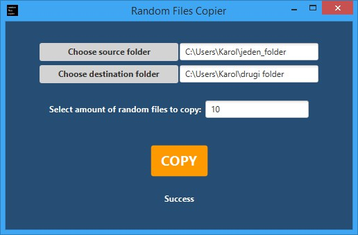

# Random Files Copier

#### JavaFX application made for self needs.

##### Explanation:
My car radio crashes when USB flash disc contains big amount of music so once in a while I put new random music on it.
The all music is stored on my computer and this is the application what does it automatically for me. 
##### I do not longer need to close my eyes and try to pick some random stuff from the folder (and folders inside folder). Working recursively.

###### Technologies used: JavaFx, Gradle

